# CS464 Assignment 01 - BSCS23204

## Game 1 - Hay Day

- **Store link:** [Hay Day on Google Play](https://play.google.com/store/apps/details?id=com.supercell.hayday)
- **Genre:** Farming and management.
- **I played:** On and off for a few years. The Play Store record shows 17 hours since my latest install. My farm is level 40, with the town unlocked at reputation level 4.

### Screenshots

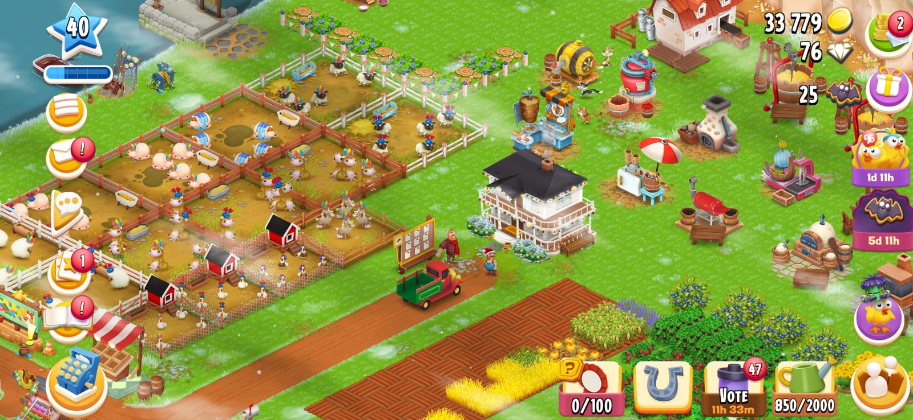

1. **[M1]** Fields, animals, and machines supply and make goods on my level 40 farm.

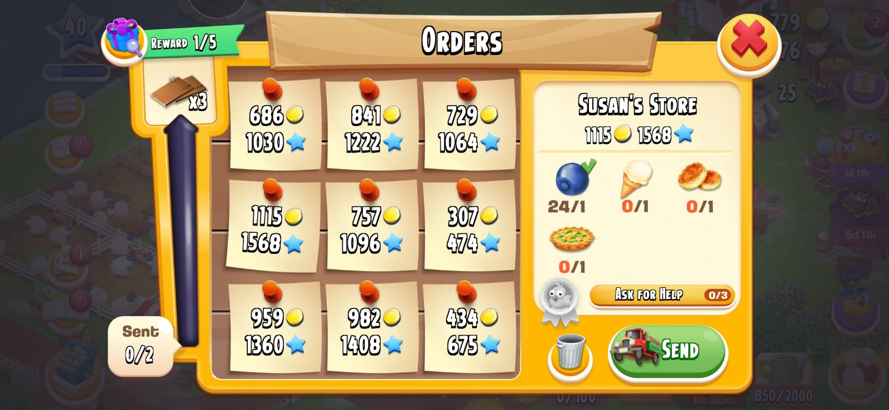

2. **[M2]** A truck order offers 1,115 coins and 1,568 XP. Some goods are missing, and the help button is available.

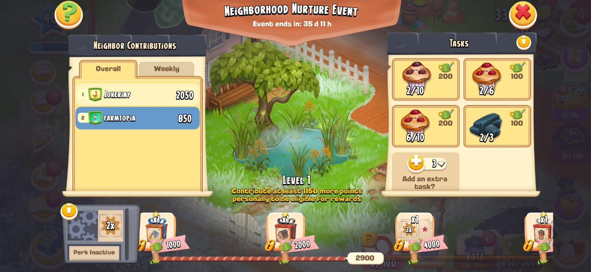

3. **[M7]** Neighborhood tasks show item targets, points, and shared reward goals. My contribution is 850 points.

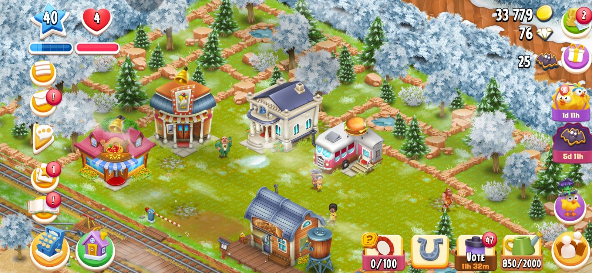

4. **Extra view:** Town service buildings also handle visitor orders. My town is at reputation level 4.

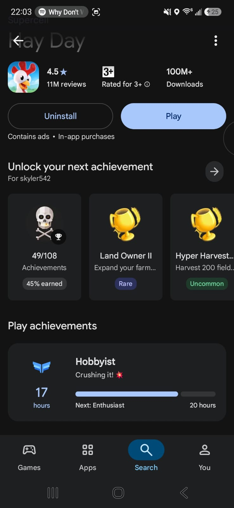

*Play record: 17 hours since the latest install.*

### Mechanics, dynamics, aesthetics, and Bartle types

The dynamics below describe likely player behaviour caused by each rule.

| # | Mechanic | Dynamic | Aesthetic | Bartle type |
|---|---|---|---|---|
| M1 | Machines use ingredients and make one product at a time, with extra products queued in slots. [Production rules](https://ingame.help.supercellsupport.com/hay-day/en/articles/product-making-2.html) | Players fill queues before a break and return to collect the goods. | **Submission:** production fits into a regular routine. | **Achiever:** making goods helps finish orders. |
| M2 | Truck orders exchange set amounts of goods for coins and XP. Players can discard orders or ask for help. [Order rules](https://ingame.help.supercellsupport.com/hay-day/en/articles/truck-orders-2.html) | Players compare rewards, choose affordable orders, and ask for missing goods. | **Challenge:** choosing orders tests resource planning. | **Achiever:** orders grow the farm's coins and level. |
| M3 | Boat orders have crates to fill before the boat leaves, with extra rewards for a full shipment. [Boat rules](https://ingame.help.supercellsupport.com/hay-day/en/articles/boat-orders-3.html) | Players prepare goods early and ask others to help fill crates before time runs out. | **Challenge:** finishing the shipment creates time pressure. | **Achiever:** completing a boat gives a clear reward goal. |
| M4 | Different lures attract different fish; new fish and weight records earn Fishing Book rewards. [Fishing rules](https://ingame.help.supercellsupport.com/hay-day/en/articles/fishing-book.html) | Players try different lures and fishing spots to fill their book. | **Discovery:** each new catch adds something to find. | **Explorer:** experimenting reveals where and how to catch fish. |
| M5 | Expanding farm land uses set amounts of land deeds, mallets, and marker stakes. [Expansion rules](https://ingame.help.supercellsupport.com/hay-day/en/articles/land-expansion.html) | Players save the needed supplies and choose which plot to unlock next. | **Challenge:** balancing supplies makes expansion a longer goal. | **Achiever:** each unlocked plot shows progress. |
| M6 | Pets such as cats, dogs, and horses eat food; using the whistle after feeding collects XP and can give supplies. [Pet rules](https://ingame.help.supercellsupport.com/hay-day/en/articles/farm-animals.html) | Players keep food ready and return to feed and wake their pets. | **Fantasy:** caring for pets adds to the feeling of owning a farm. | **Achiever:** pet care also earns XP and useful items. |
| M7 | Neighborhood event tasks award points toward shared rewards, with a personal contribution target. | Neighbors choose tasks they can finish and work toward the group goal. | **Fellowship:** progress depends on working together. | **Socializer:** the shared goal encourages group participation. |

**Aesthetic profile:** Submission comes from the production routine (M1). Challenge comes from orders, boat deadlines, and expansion supplies (M2, M3, M5). Fellowship comes from helping with orders and working on neighborhood goals (M2, M3, M7).

**Player types**

- **Primary: Achiever - acting on the world.** Players make goods, finish orders, collect supplies, and expand their farm (M1-M3, M5, M6).
- **Secondary: Socializer - interacting with players.** Order help and shared neighborhood goals give farmers reasons to work together (M2, M3, M7).

## Game 2 - Need for Speed No Limits

- **Store link:** [Need for Speed No Limits on Google Play](https://play.google.com/store/apps/details?id=com.ea.game.nfs14_row)
- **Genre:** Arcade racing.
- **I played:** On and off for a few years. The Play Store record shows 9 hours since my latest install. My account is level 27, with several cars unlocked.

### Screenshots

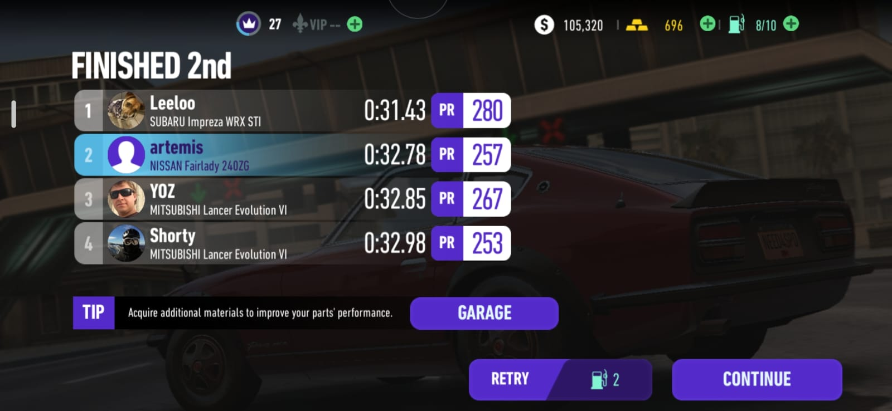

1. **[M1, M4]** I finished second in 32.78 seconds. Retrying costs 2 fuel, and my car has PR 257.

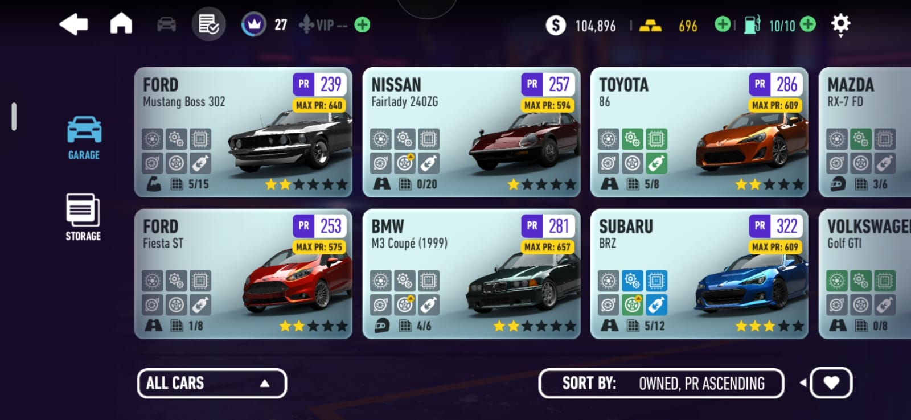

2. **[M5, M6]** My garage shows car ratings, fitted parts, stars, and blueprint counts. The Subaru BRZ has PR 322 and 5/12 blueprints.

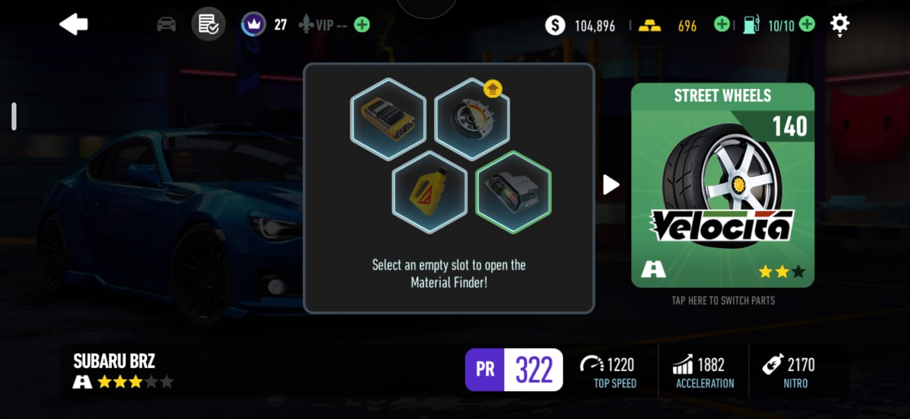

3. **[M5]** The parts screen shows material slots and separate top speed, acceleration, and nitro stats for the Subaru BRZ.

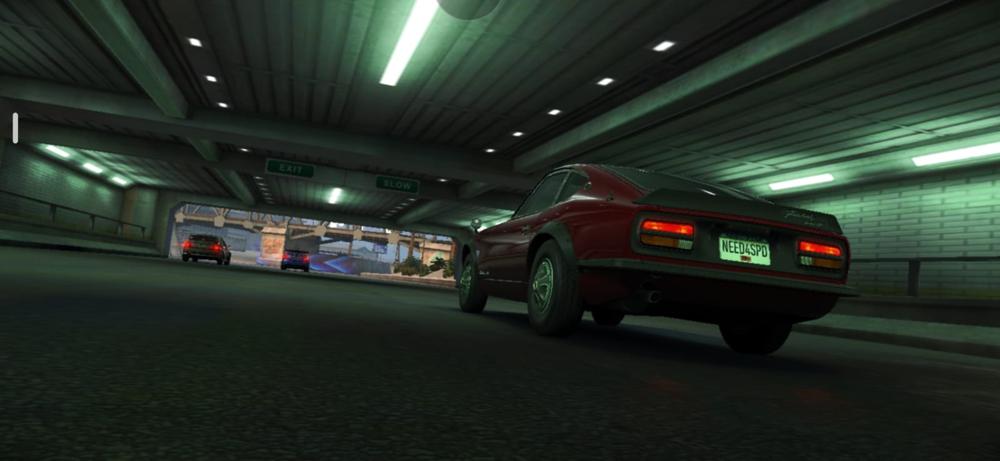

4. **[M1]** A race scene with my Nissan Fairlady and other cars on the track.

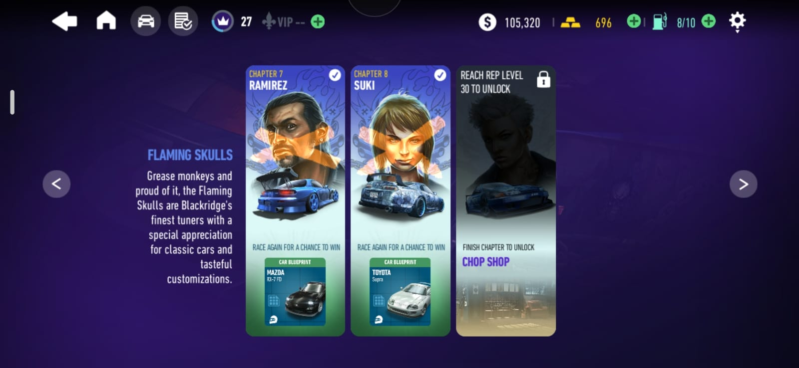

5. **[M2, M6]** Ramirez and Suki's chapters are completed. The next chapter needs REP level 30. Finished chapters can be replayed for a chance at car blueprints.

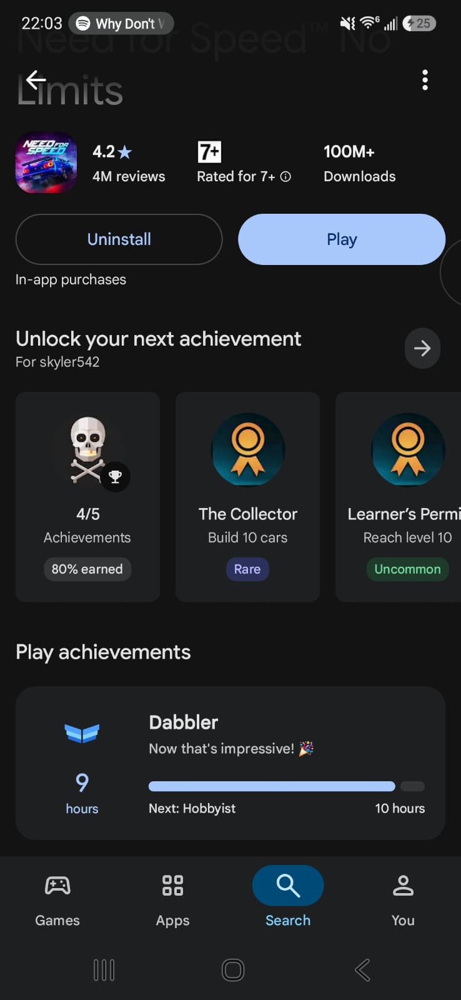

*Play record: 9 hours since the latest install.*

### Mechanics, dynamics, aesthetics, and Bartle types

The dynamics below describe likely player behaviour caused by each rule.

| # | Mechanic | Dynamic | Aesthetic | Bartle type |
|---|---|---|---|---|
| M1 | Standard races rank cars by finish order and show each finishing time. | Players retry races and improve their driving to place first. | **Challenge:** beating the race takes skill and practice. | **Achiever:** first place is a clear goal. |
| M2 | The story campaign has chapters built around rival racers and crews, with REP requirements to unlock later chapters. My next chapter needs REP level 30. [EA campaign notes](https://www.ea.com/games/battlefield/news/25-years-of-nfs-anniversary-update) | Players build REP between chapters to continue the story and meet the next rival. | **Narrative:** races advance a story about Blackridge's racers and crews. | **Explorer:** progressing reveals more characters and their place in the racing world. |
| M3 | Activating nitro gives a temporary speed boost. | Players save boosts for useful moments, such as straights or overtaking. | **Challenge:** boost timing can change the result. | **Achiever:** better timing helps win races. |
| M4 | The shown race costs 2 fuel to retry, and the fuel meter has a 10-unit capacity. | Players decide whether another attempt is worth the fuel or whether to upgrade first. | **Challenge:** limited attempts make race choices matter. | **Achiever:** fuel is spent toward race progress. |
| M5 | Materials fill car-part upgrade slots; these parts affect top speed, acceleration, and nitro stats. | Players compare weak stats and choose which part to improve first. | **Discovery:** changing parts reveals how the car's performance changes. | **Explorer:** players learn the car's performance system. |
| M6 | Car blueprints fill a star-progress counter; the shown BRZ has 5 of the 12 needed. Campaign replays offer a chance at specific car blueprints. | Players return to chapters that reward the car they want to develop. | **Challenge:** collecting enough blueprints creates a longer goal. | **Achiever:** reaching the next star gives visible progress. |
| M7 | Players can apply customisation options to change a car's exterior. | Players try different looks and choose a style they like. | **Expression:** the car shows personal taste. | **Explorer:** players explore the available styles. |

**Aesthetic profile:** Challenge comes from winning races, timing boosts, and managing fuel (M1, M3, M4). Narrative comes from following rival racers through the campaign chapters (M2). Expression comes from customising the car's exterior (M7).

**Player types**

- **Primary: Achiever - acting on the world.** Players aim for wins and higher-star cars by improving results and collecting blueprints (M1, M3, M4, M6).
- **Secondary: Explorer - interacting with the world.** Players uncover rival stories and explore car parts and visual options (M2, M5, M7).

## Level blockouts

These five levels are inspired by the floating buildings and bubbles in the movie *Bubble*. They share a prefab kit in `Assets/Prefabs/`.

Blue capsule = start. Blue bubbles = jump points. Green beacon = goal. Green floor marks = breadcrumbs.

Open `Level01` to `Level05` in `Assets/Scenes/` to view them in Unity. These are static blockouts with no movement scripts.

| Level | Screenshot | Its idea | Wayfinding tool |
|-------|------------|----------|-----------------|
| Level01 | 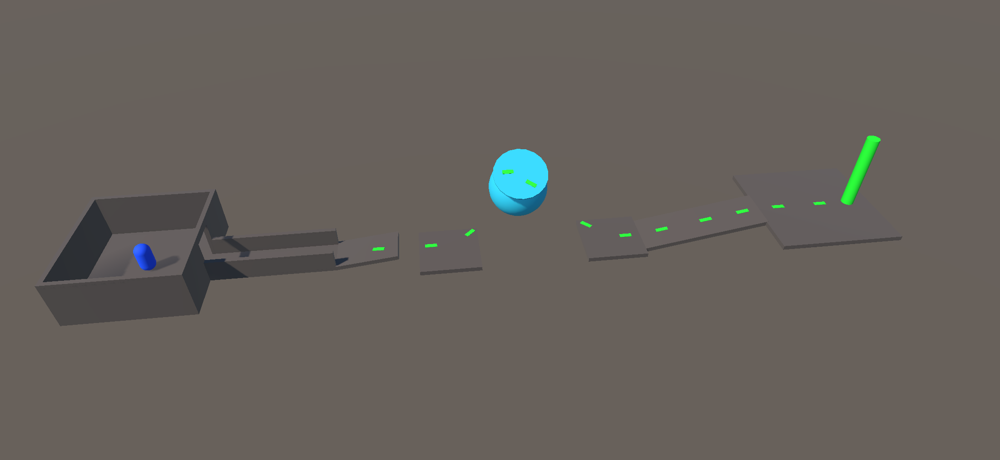 | Jump between flat platforms using a raised, tilted bubble. | Breadcrumbs mark the jumps. Barriers point toward the crossing, and the beacon marks the goal. |
| Level02 | 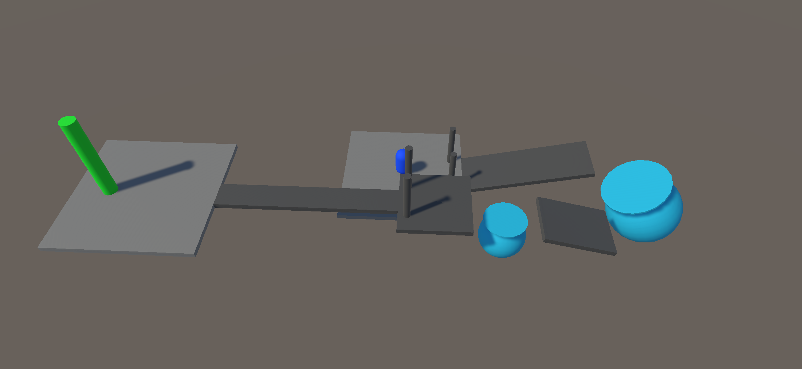 | Climb two ramps, turn back, then jump up and cross a narrow bridge. | Pillars frame the ramp and bridge entrances. The green beacon is a landmark. |
| Level03 | 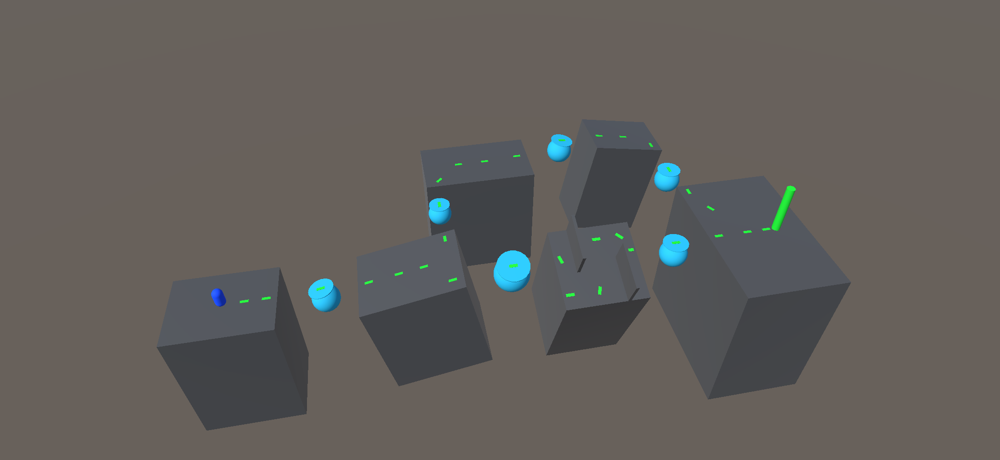 | Choose a short tilted-roof route with wall obstacles or a longer route around the buildings. | Breadcrumbs show both routes and their jumps toward the goal. |
| Level04 | 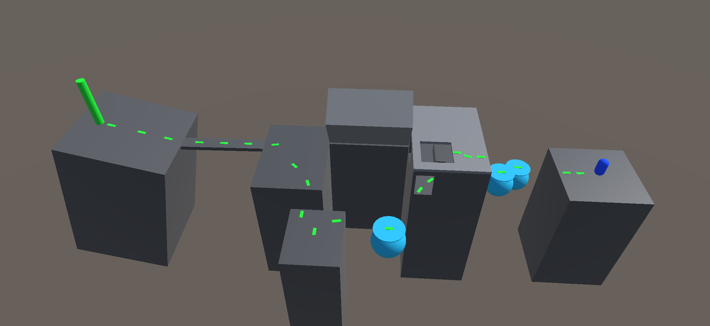 | Enter through a door or drop through the roof, then take a side exit around a blockage. | Breadcrumbs lead to the roof opening, side exit, and final beam. |
| Level05 | 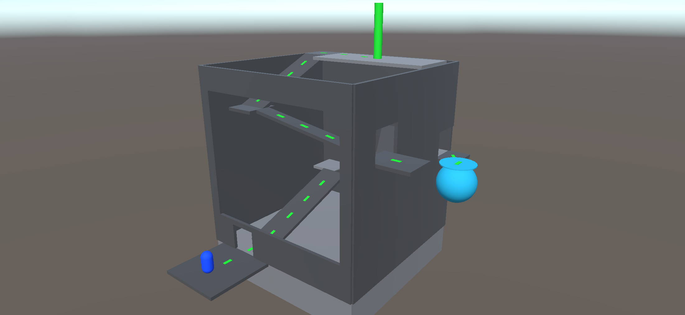 | Climb inside a tower, jump outside, return through a higher opening, and cross a beam to reach the roof. | Breadcrumbs guide the climb and wall openings. The rooftop beacon marks the goal. |

### Level01 - Raised bubble crossing

Leave the start room and jump across the platforms. The middle bubble sits higher and tilts 30 degrees to the right. A final ramp leads to the goal.

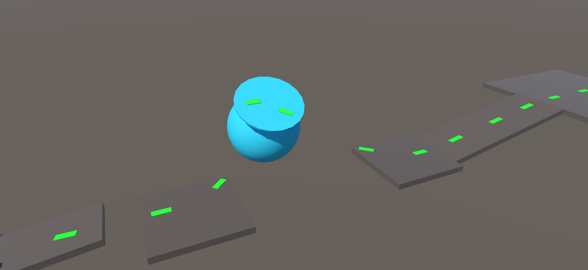

*Raised bubble between two flat platforms.*

### Level02 - Climb and turn

Climb the first ramp, use the tilted bubble to turn onto the next ramp, then jump from a low bubble to the upper landing. Cross the 1.5 m-wide bridge to finish.

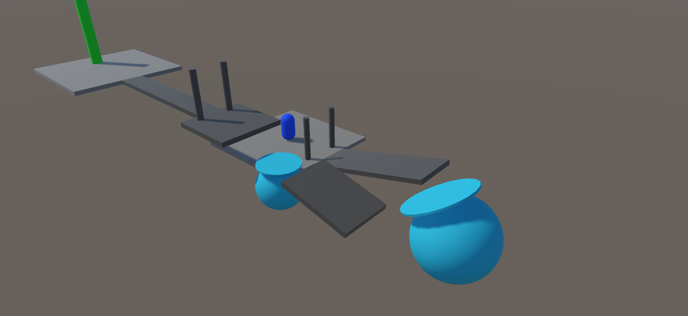

*Two ramps, a tilted bubble, and a low bubble before the upper landing.*

### Level03 - Two rooftop routes

Walk on the building roofs and use bubbles to cross gaps. The short route has a sideways-tilted roof and walls to move around. The longer route goes around the outer buildings. Both reach the same goal.

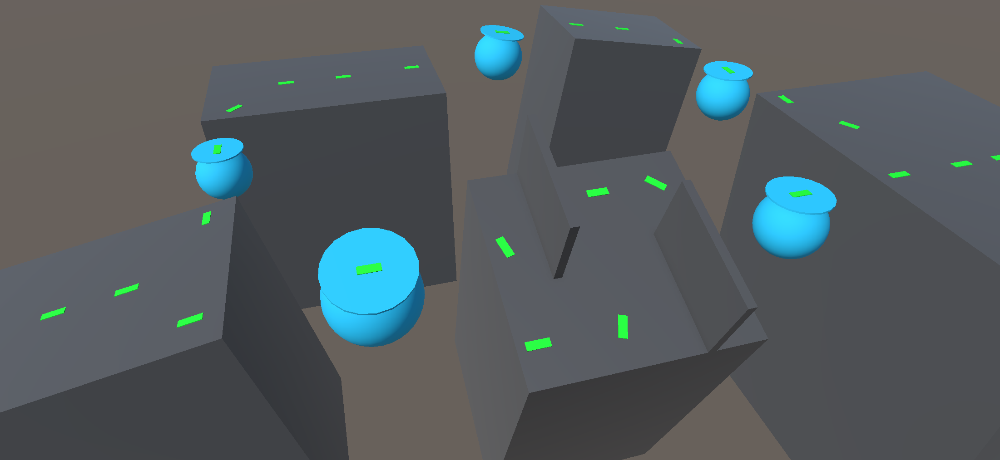

*Tilted roof and wall obstacles, with the longer route behind them.*

### Level04 - Collapsed room and roof drop

Enter through the door or use the higher bubble to reach the roof and drop into the room. Low cover and a fallen building block the way forward. Take the side exit, jump across the low bubble, and cross the final beam to the goal.

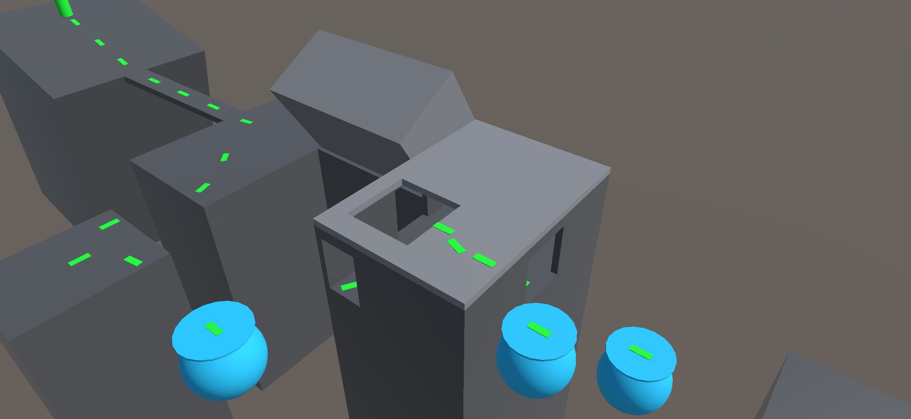

*Higher bubble and roof opening above the room.*

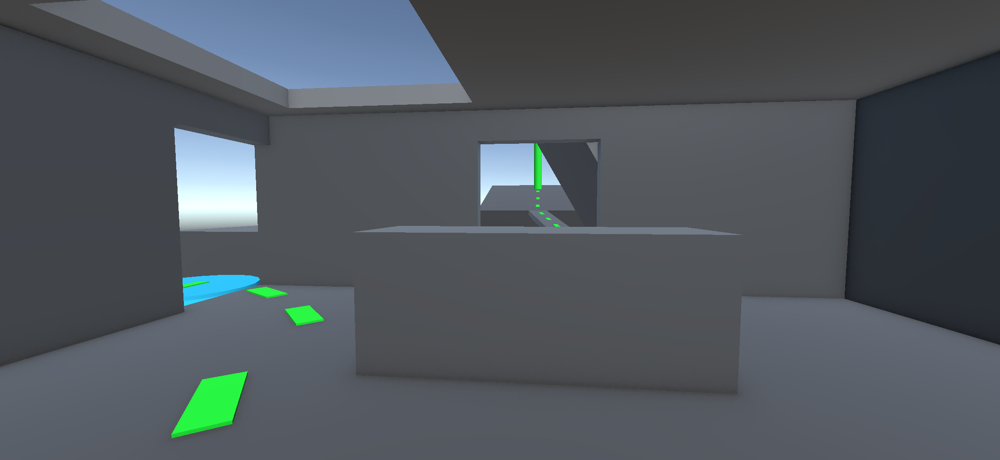

*Roof opening, low cover, and breadcrumbs leading to the side exit.*

### Level05 - Broken tower climb

Climb the tilted floors inside the tower. A broken floor sends you outside, where a bubble leads to a higher opening. Go back inside, cross the 1.5 m-wide beam over the open shaft, and climb the last ramp to the roof.

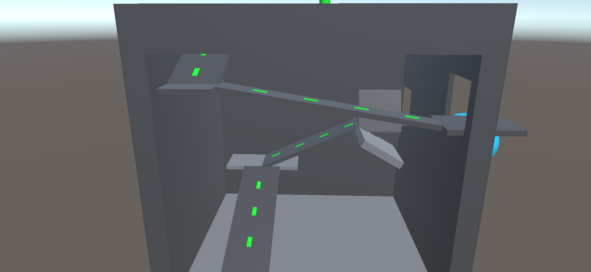

*Tilted floors and the narrow beam across the open shaft.*

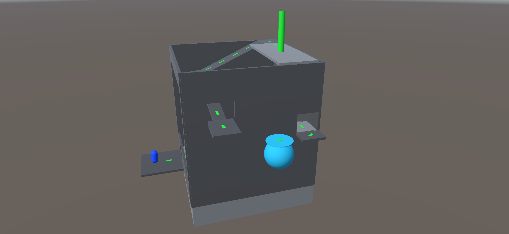

*Bubble between the lower exit and higher entrance.*
